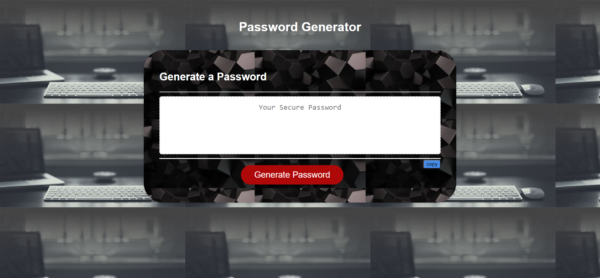

# generate-password-repo
This application develops random paasword  based on criteria that they’ve selected. This app will run in the browser and will feature  HTML and CSS powered by JavaScript code . It will have a clean and polished, responsive user interface that adapts to multiple screen sizes.

## User Story
```
AS AN employee with access to sensitive data
I WANT to randomly generate a password that meets certain criteria
SO THAT I can create a strong password that provides greater security
```

## Acceptance Criteria

```
GIVEN I need a new, secure password
WHEN I click the button to generate a password
THEN I am presented with a series of prompts for password criteria
WHEN prompted for password criteria
THEN I select which criteria to include in the password
WHEN prompted for the length of the password
THEN I choose a length of at least 8 characters and no more than 128 characters
WHEN asked for character types to include in the password
THEN I confirm whether or not to include lowercase, uppercase, numeric, and/or special characters
WHEN I answer each prompt
THEN my input should be validated and at least one character type should be selected
WHEN all prompts are answered
THEN a password is generated that matches the selected criteria
WHEN the password is generated
THEN the password is either displayed in an alert or written to the page
```
## Mock-Up

The following image shows the web application's appearance and functionality:


## Features
 1.  Wrapper div and card div is updated with background image
 2. Tool tip is added on button element.
 3. Updated copy button on card-body 
 4. Added hovering effect on h1 element.
 5. Code used to get array of random values
    ```javascript
 
    for (let i = 0; i < length; i++) {
                password.push(String.fromCharCode(randomArray[Math.floor(Math.random() * randomArray.length)]));
     } 
 

 6. The thing observed is below commands is not supported for disabled button.
    ``` javascript
    text.select()
    document.execCommand('copy')
    ```
    Change the button to readonly or else use the 
    code for copy button as below
    ```javascript
    function myFunction() {
    var pw = document.getElementById("password");
    /* Copy the text inside the text field */
    navigator.clipboard.writeText(pw.value);

    console.log("copied text " + pw.value);
    alert("copied. ")
    }
## API References
  [visit website]("https://www.youtube.com/watch?v=VTc4gqvckr8")
 
  [arraytoString](https://wsvincent.com/javascript-convert-array-to-string/ )
  
  [stack overflow](https://stackoverflow.com/questions/55626559/document-execcommandcopy-not-working-on-all-browser)

## Review

You are required to submit the following for review:

* [The URL of the deployed application]("https://programer122223.github.io/generate-password-repo/)
  

* 
[URL Github REPOSITORY](https://github.com/PROGRAMER122223/generate-password-repo.git)
